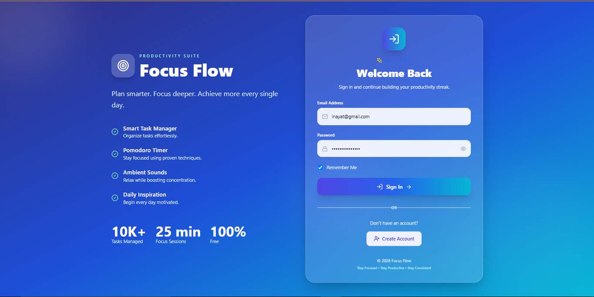
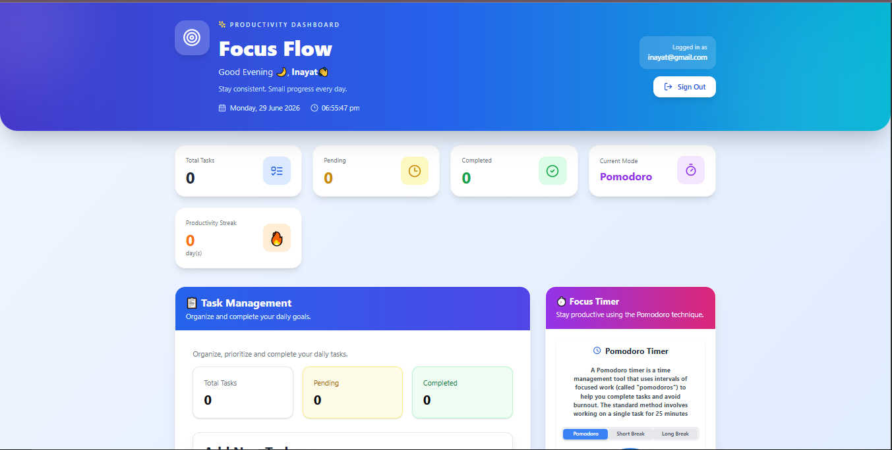
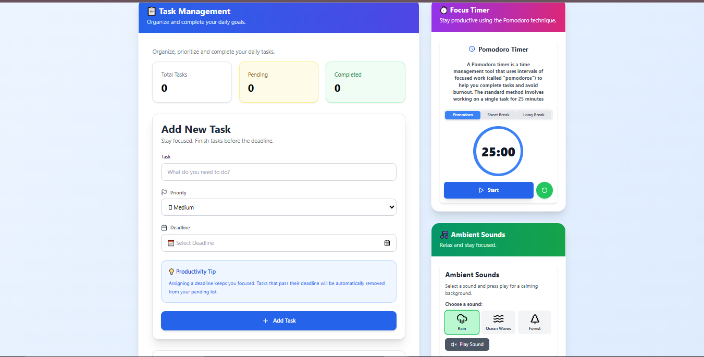
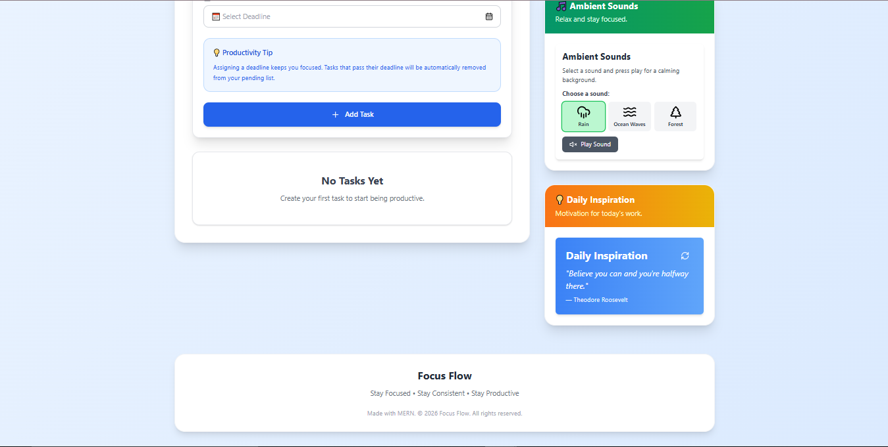

# 🎯 Focus Flow – Smart Productivity Dashboard

Focus Flow is a modern **full-stack productivity web application** built using the **MERN Stack** to help users organize tasks, stay focused, and improve productivity. The application combines **task management**, **Pomodoro time management**, **ambient sounds**, **daily motivational quotes**, and a **real-time productivity dashboard** into one seamless workspace.

Designed with a clean, responsive UI and secure authentication, Focus Flow provides an engaging experience for students, professionals, freelancers, and anyone looking to manage their daily workflow more efficiently.

---

## 🌐 Live Demo

🔗 https://focus-flow-vite.vercel.app/

---

## 📸 Screenshots

> Add screenshots of:
- Landing / Authentication Page
  <p align="center">
    
  </p>
  
- Dashboard
  <p align="center">
    
  </p>
- Task Management
  <p align="center">
    
  </p>
  
- Productivity Dashboard
  <p align="center">
    
  </p>


---

# ✨ Features

## 🔐 Authentication

- Secure User Registration & Login
- JWT Authentication
- Remember Me functionality
- Protected Routes
- Session Management

---

## 📋 Smart Task Management

- Create Tasks
- Edit Tasks
- Delete Tasks
- Mark Tasks as Completed
- Task Priorities
- Due Date & Time
- Session Expiry
- Real-time Dashboard Updates

---

## ⏱ Pomodoro Timer

- 25 Minute Focus Session
- 5 Minute Short Break
- 15 Minute Long Break
- Circular Progress Indicator
- Timer Completion Notification
- Automatic Next Session
- Audio Notification
- Pause / Resume / Reset Timer

---

## 📊 Productivity Dashboard

- Total Tasks
- Completed Tasks
- Pending Tasks
- Current Focus Mode
- Productivity Streak
- Live Date & Time
- Personalized Greeting

---

## 🎵 Ambient Sounds

- Rain Sound
- Relaxing Background Audio
- Improves Concentration

---

## 💡 Daily Inspiration

- Motivational Quotes
- Refreshing Daily Inspiration

---

## 🎨 User Interface

- Modern Dashboard
- Responsive Design
- Glassmorphism Authentication
- Beautiful Gradient Theme
- Mobile Friendly
- Interactive Components

---

# 🛠 Tech Stack

### Frontend

- React.js
- TypeScript
- Vite
- Tailwind CSS
- Axios
- Lucide React

### Backend

- Node.js
- Express.js
- MongoDB
- Mongoose
- JWT Authentication
- bcrypt.js
- CORS

### Database

- MongoDB Atlas

### Deployment

- Frontend — Vercel
- Backend — Render
- Database — MongoDB Atlas

---

# 📂 Project Structure

```
Focus Flow
│
├── frontend
│   ├── src
│   ├── components
│   ├── pages
│   ├── services
│   └── public
│
├── backend
│   ├── config
│   ├── controllers
│   ├── middleware
│   ├── routes
│   └── server.js
│
└── README.md
```

---

# 🚀 Installation

## Clone Repository

```bash
git clone https://github.com/inayatilkal/focus_flow_vite.git
```

## Frontend

```bash
cd frontend

npm install

npm run dev
```

## Backend

```bash
cd backend

npm install

npm start
```

---

# 🔑 Environment Variables

Create a `.env` file inside the backend folder.

```env
PORT=5000

MONGODB_URI=YOUR_MONGODB_URI

JWT_SECRET=YOUR_SECRET_KEY
```

Frontend `.env`

```env
VITE_API_URL=http://localhost:5000/api
```

---

# 💻 Application Workflow

1. User Registration / Login
2. JWT Authentication
3. Dashboard Access
4. Manage Tasks
5. Start Pomodoro Session
6. Listen to Ambient Sounds
7. Track Productivity
8. Build Daily Habits

---

# 📈 Future Enhancements

- AI Task Prioritization
- Google Calendar Integration
- Email Notifications
- Dark Mode
- Weekly Productivity Reports
- Charts & Analytics
- Team Collaboration
- Progressive Web App (PWA)
- Push Notifications
- Recurring Tasks

---

# 🎯 Learning Outcomes

This project enhanced my understanding of:

- Full-Stack MERN Development
- REST API Development
- JWT Authentication
- MongoDB Integration
- React State Management
- TypeScript
- Responsive UI Design
- Deployment on Vercel & Render

---

# 🤝 Contributing

Contributions are welcome!

1. Fork the repository
2. Create your feature branch
3. Commit your changes
4. Push to your branch
5. Open a Pull Request

---

# 👨‍💻 Author

**Inayat Ilkal**

- GitHub: https://github.com/inayatilkal
- LinkedIn: *https://www.linkedin.com/in/inayat-ilkal/*

---

## ⭐ Support

If you found this project helpful, please consider giving it a **⭐ Star** on GitHub!
